# Project3-covid-explorer
Exploring different ML algorithms and Solidity using COVID dataset
## Background
New startup has decided to run a COVID explorer program in order to help one of the health institues to perform data analysis functions. Though there are huge number of freely available covid dashboards in the internet the company decided to create an inhouse capability. Thereby developing their own dashboard using different machine learning algorithms and made use of solidity.  This program will help the company to show current covid trends of a selected country. Using the linear regression algorithm they can predict the covid cases for a selected country. Not only that it can also compare two different countries data and show the trend between them. The Company also introduced "BlockVax" as a smart contract which interacts with the ethereum network to allow users to register a profile for themselves or others, generating a unique patient ID number and storing the profile data in a profile struct as part of a mapping. Their profile registration will require their address as well as a photo ID, which will be uploaded to [pinata](https://pinata.cloud/) and stored via an IPFS hash.

In order to launch this prgoram, company needed to access historical COVID data which will be available and downloaded from the World Health Organisation website.

Creating a Project

Detail informaion about project and Team Members

### Details about Project 
This Project was divided into four parts:
1. Data cleaning and data analysis
2. Creating Dashboard using Python code and machine algorithm to plot different graphs using streamlit
3. AWS to create a Chatbot to communnnicate with the Public for covid related queries.
4. Solidity patient contract to verify whether patient has been vaccinated or not.
This will include:
           * Restriction of provider function use to only providers registered in the contract
           * The vaccine name having to match our stored vaccine names
           * Only valid patient IDs
           * Only registered/valid patient addresses can be inputted

           
### Team Members

* Purvi Doshi

* Antonio Aguilar

* Paulina Filippidis

* Harrison Marcus Clark

* Khushboo Bhatnagar
           

How we build it

           
### Build Instruction

1. Based on owid-covid-data.csv file, data has cleaned and removed all the null values.
2. To develop interaticeve webdashboard, different machine learning algorithm was considered and finally team decide to work on *Linear Regreassion* and *Timeseries Analysis*
3. *Correlation Explorer* webpage was another way to represent corelation between few selected columns of the csv file.
4. As per the commoan definition of Linear Regression which is a statistical method for modelling relationship between a dependent variable with a given set of independent variables. From owid-covid-data.csv file team used total_cases as depedent variable and compare with all 50 independent variables. In short, Simple Linear regression method used to show the prediction of total covid cases for selected country.
5. TimeSeries Analysis is comparing data between two countries and displaying graphs for daily new cases and people fully vaccinated in both countries.
6. BlockVax is a smart contract which interacts with the ethereum network to allow users to register a profile for themselves or others, generating a unique patient ID number and storing the profile data in a profile struct as part of a mapping. Their profile registration will require their address as well as a photo ID, which will be uploaded to [pinata](https://pinata.cloud/) and stored via an IPFS hash.
7. Once a profile has been created, registered vaccine providers are able to update vaccine data of vaccinated patients by using the patient's address and ID number and photo URI as part of our token JSON scehma shown below.
8. This function will then mint a non-fungible token using the patient's address and ID number and set the token URI, as well as update the patient's profile with the vaccine data.
9. Modifier's were created to restrsict function access and to ensure only the right data can be inputted, since this contract interacts with a blockchain and hence immutable, we do not want to waste gas fees on data errors or accidentally input incorrect data.
10. Finally, our last function allows the user to search for a patient ID and check if they've been vaccinated
           

### Development Instruction

* pip install streamlit
* pip install altair

### Technology Used

* Python
* Streamlit
* Altair to display graph using streamlit
* Solidity
* Chatbot
* Metamask
* pinata

Deploying the Project

           
### How to run from local machine
To run this application on local gitbash environment, go to the gitbash terminal where streamlit is installed and run the following command on command line:                   __*streamlit run finalmain.py*__
                      
### Steps on How to deploy project in Heroku - Free App

1. Before deploy your app to Heroku, you need to initialize a local Git repository and commit your application code to it. 
The following example demonstrates initializing a Git repository for an app that lives in the finalapp directory:
  
                      $ cd covid-explorer
                      $ git init 
                      $ git add. 
                      $ git commit 
2. Create a Heroku Account [Here](https://signup.heroku.com/) In general, using Heroku is free but in order to get more features like application metrics or free SSL you'll have to pay.
3. Now that you have an account you will have to [download Heroku's Command Line Interface](https://devcenter.heroku.com/articles/getting-started-with-python#set-up).
4. Login to Heroku
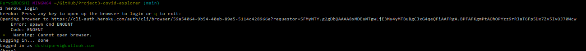
5. Finally, you can deploy your application to heroku by running *heroku create* in your gitbash commandline to create an Heroku instance.

           1. Type heroku create covid-explorer
           2. Push the code using git repo commands
           
                      $ git add . 
                      $ git commit -m "Final code" 
                      $ git push heroku main 
                      
6. You can check if the application was deployed successfully using heroku ps:scale web=1. 
7. Finally, the application can be opened with heroku open. This will open the app using your default browser.

 

 

           
  
  
#### Project Images

Streamlit Interatice webapp

 

         
#### First Web Page   
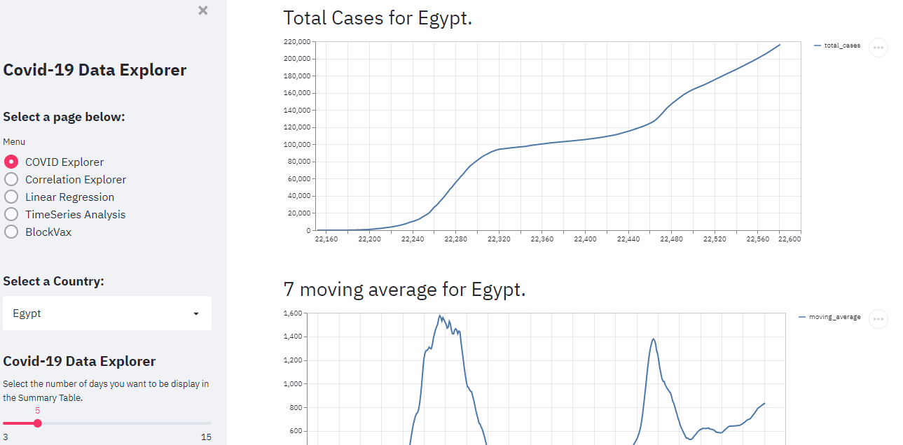     

#### Second Web Page
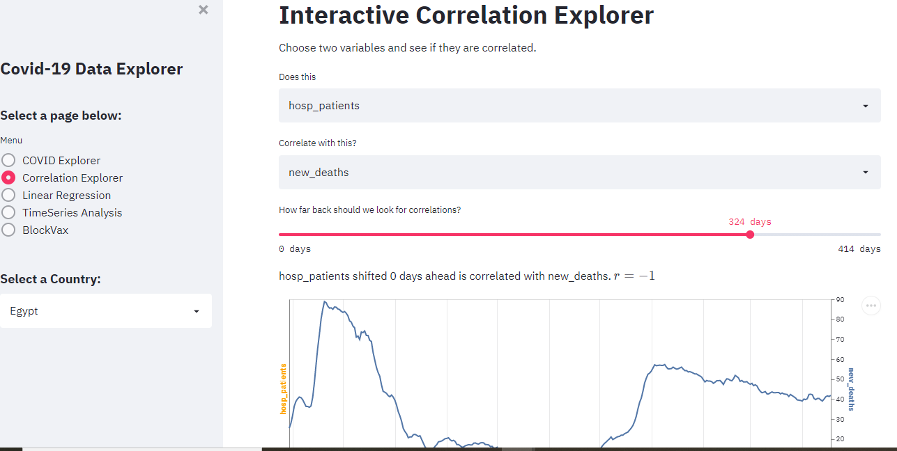

#### Third Web Page
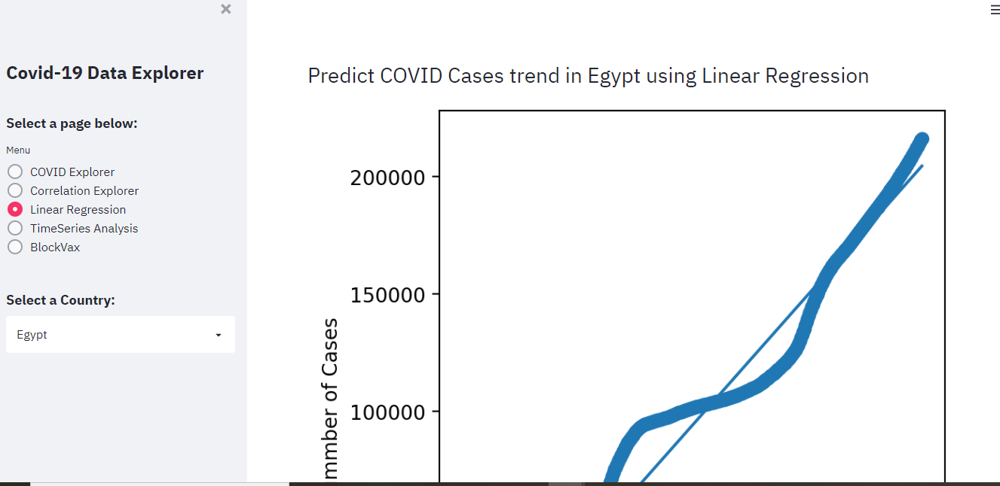

#### Fourth Web Page
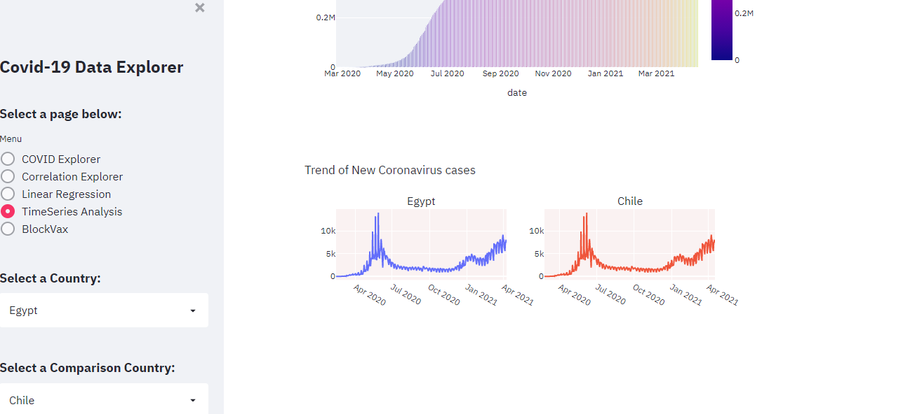

Solidity Example-BlockVax

            
 Mapping Struct          | Register Patient Func      | JSON Token Schema                        
  -----------------------|----------------------------|-----------------------
  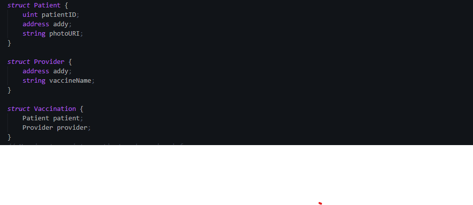      | 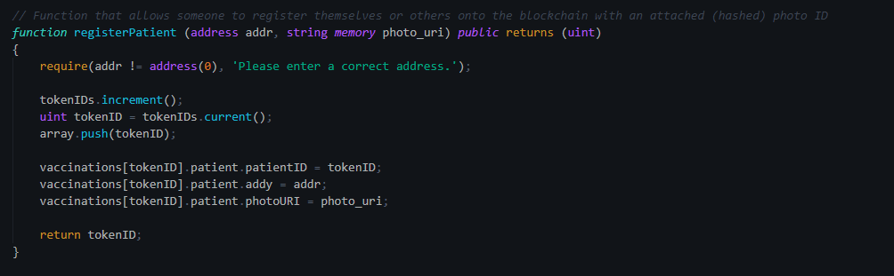 | 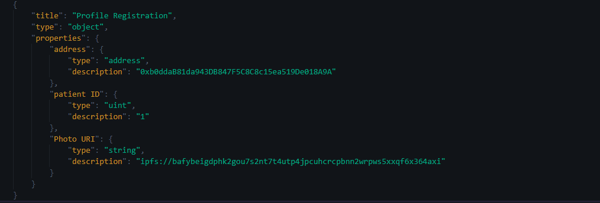
  
 Register Provider Func          | Global Variables   | Modifiers                         
  -----------------------|----------------------------|-----------------------
  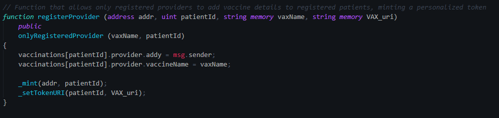      | 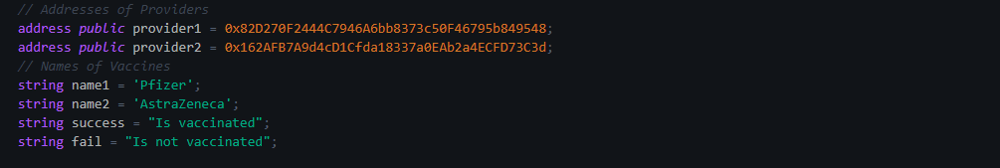 | 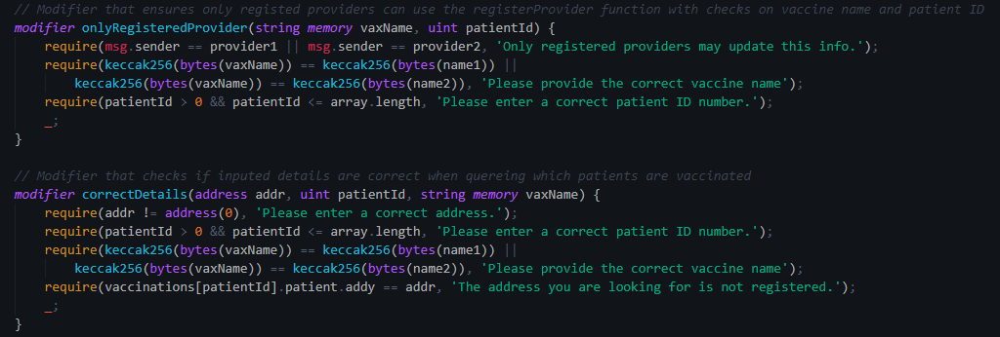
  
 

Chatboat Example- COVID Buddy

        
          
      
 

#### Data Source and Resource

Data Source

1. https://github.com/owid/covid-19-data  
2. https://ourworldindata.org/covid-vaccinations

References

 1. https://discuss.streamlit.io/  
 2. https://streamlit.io/gallery?type=apps&category=geography-society 
 3. https://www.youtube.com/watch?v=k-d27B5hnqc  
 4. https://github.com/E-Health/vac-chain/blob/develop/contracts/Encounter.sol  
 

